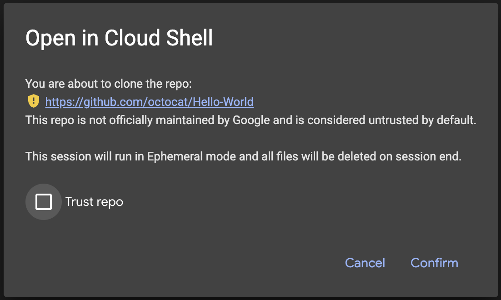
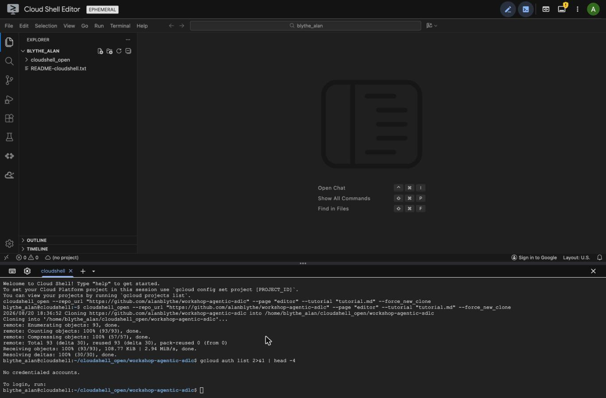
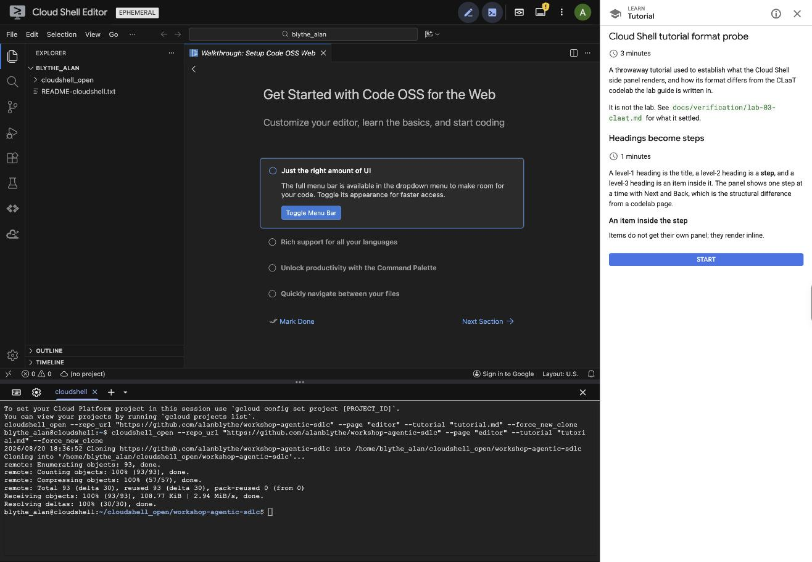

# LAB-03 — `claat` findings

Verified 2026-08-20 on macOS 15 (arm64), Go 1.26.5, against `claat` built from
`github.com/googlecodelabs/tools/claat@latest`, which resolved to
**`v0.0.0-20240220115335-873fe39d02dc`** — a Feb 2024 pseudo-version. That is
the newest thing the module proxy offers.

The Pages-hosting checkbox is **not** covered here; it needs a repo decision.

## Install

There is no Homebrew formula:

```
Error: No available formula with the name "claat". Did you mean clamav, lavat or clac?
```

`go install` is the install path, and it is fast — 8 seconds cold:

```shell
go install github.com/googlecodelabs/tools/claat@latest
```

The binary lands at `$(go env GOPATH)/bin/claat` (15 MB) and needs
`$(go env GOPATH)/bin` on `PATH`. **Go is therefore a prerequisite for anyone
who builds the guide**, though not for attendees, who only read the output.

`claat version` prints an empty line and exits 0. The version string is
injected by `-ldflags` in the project's own release build, so a `go install`
binary cannot report what it is. Pin by module pseudo-version instead.

## Export

```shell
claat export probe.lab.md
```

Output on success is one line per source, `ok\t<id>`. It writes a directory
named for the metadata `id`, in the current directory unless `-o` is given:

```
claat-probe-b/index.html
claat-probe-b/codelab.json
```

The `.lab.md` extension is accepted — `claat` chooses the Markdown parser for
anything that is not a Google Doc ID, so the double extension is inert.

`claat update` re-exports every directory under the current one that holds a
`codelab.json`, reusing the flags recorded in it. That is the CI shape for
LAB-16.

## Durations sum — but not from the house template's syntax

**Confirmed summing, with a caveat that changes every duration tag in the
guide.**

The step parser splits `Duration:` on `:` and right-aligns the parts against
`[hour, minute, second]`. So:

| Written | Parsed as | Rendered |
|---|---|---|
| `Duration: 7` | 7 minutes | 7 |
| `Duration: 0:07` | 0 min **7 seconds** | **1** |
| `Duration: 0:07:00` | 0h 7m 0s | 7 |

Any fractional minute rounds **up**, so `0:07` becomes one minute rather than
zero — a silent, plausible-looking wrong answer, not an error.

Two identical five-step codelabs differing only in duration syntax:

```
claat-probe-a  (Duration: 0:02 / 0:07 / 0:12 / 0:04 / 0:01)  "duration": 5
claat-probe-b  (Duration: 0:02:00 / … / 0:01:00)             "duration": 26
```

2 + 7 + 12 + 4 + 1 = 26. Loaded in a browser off a local static server,
probe-b's navbar reads **`26 mins remaining`** and each
`<google-codelab-step>` carries the right per-step `duration` attribute. Every
step's tag counts, including step 1 and the final step.

**The house template's `Duration: 0:05` means five seconds to this compiler.**
Use `Duration: 5` or `Duration: 0:05:00`. LAB-04 wants tags summing to ~59
minutes; written the house way it would publish as 12.

## The house template is DevSite CLaaT, and OSS `claat` is not

These are two different compilers. Three of the house template's rules are
rejected or silently ignored by the binary that will actually build this guide.

### YAML frontmatter is not accepted

A `---`-fenced block fails outright:

```
err	probe.lab.md invalid metadata format, missing at least id: map[duration:0:02]
```

`claat` reads metadata from the **first paragraph of the document** — bare
`key: value` lines above the `#` title, no fences:

```
summary: What the reader builds
id: agentic-sdlc-lab
categories: cloud,agents
environments: Web
status: Draft
authors: Alan Blythe
feedback link: https://github.com/…/issues

# Title
```

Recognised keys, and only these: `authors`, `summary`, `id`, `categories`,
`environments`, `status`, `feedback_link`, `analytics_account`,
`analytics_ga4_account`, `tags`, `source`, `duration`. Keys are snake-cased
before matching, so `feedback link` with a space works.

`description`, `keywords`, `layout`, `project` and `book` — five of the house
template's eight fields — are **dropped without warning** unless named in
`-pass_metadata`. In particular the summary comes from `summary`, not
`description`; with `description` the exported `"summary"` is `""`.

### `Positive` / `Negative` callouts do not render

The definition-list syntax needs a `<dt>`, and `claat` builds its Markdown
tree with goldmark configured for only the Typographer and Table extensions —
no definition lists. `isInfobox` can therefore never fire from a Markdown
source. It is dead code for this input format.

```markdown
Positive
: **Tip:** …
```

renders as the literal paragraph `Positive : Tip: …`. No error, no styling.

The syntax that works is a blockquote whose first line is `aside positive` or
`aside negative`:

```markdown
> aside positive
>
> This is a tip.

> aside negative
>
> This is a warning.
```

Confirmed in a browser: green left-rule tip box and amber warning box,
`<aside class="special">` and `<aside class="warning">`.

### Buttons must be one line

`isButton` matches an actual `<button>` element, which raw HTML passes
through. It must be on a single line, or the Markdown link inside is never
parsed:

```markdown
<button>[Open in Cloud Shell](https://…)</button>
```

renders `<paper-button class="colored" raised>`. Split across three lines it
emits the literal text `[Open in Cloud Shell](https://…)`. The house
template's plain `[Label](url)` is a plain link; so is `[**Label**](url)`.

## Numbered step headings double-number

`codelab-elements.js` prefixes the step index to the step title itself. The
drawer uses the label verbatim and draws its own numbered circle. So the house
rule `## 1. Before you begin` produces:

- step title: **`1. 1. Before you begin`**
- drawer entry: circle `1` + `1. Before you begin`

Dropping the number from the heading gives the right result in both places —
title `1. Before you begin`, drawer circle `1` + `Before you begin`. **Do not
number `##` headings.**

## Hosting shape

`-f html` (the default) emits a single `index.html` per codelab that pulls four
scripts and one stylesheet from `https://storage.googleapis.com/claat-public/`
plus Google Fonts and `//support.google.com/inapp/api.js`. All reachable (200)
from here. Nothing is vendored, so a restricted customer network that blocks
`storage.googleapis.com` gets an unstyled, non-interactive page — the drawer,
the progress bar and the timer are all in `codelab-elements.js`. Worth adding
to LAB-20's restricted-network run.

`-f offline` is **not** a usable escape hatch. It splits into `step-N.html`
and, with the default `-prefix`, concatenates without a separator:

```html
<link rel="stylesheet" href="https://storage.googleapis.comstyles/codelab.css">
<script src="https://storage.googleapis.comscripts/codelab.js"></script>
```

`-prefix ./` fixes the paths, but `claat` never emits `styles/codelab.css` or
`scripts/codelab.js` at all. Truly self-contained hosting means vendoring the
`claat-public` assets and passing `-prefix` yourself.

**`-ga` defaults to `UA-49880327-14`** — Google's own Codelabs property — and
it is written into every exported page as
`<google-codelab-analytics gaid="UA-49880327-14">`. Pass `-ga ""` or a real
property. Do not ship the default.

## Cloud Shell deep link — documented form established, house form unproven

The two forms in the issue are not equivalent, and only one is documented.

**Use this:**

```
https://shell.cloud.google.com/cloudshell/editor?cloudshell_git_repo=https://github.com/ORG/REPO
```

How that was established: Google's *Open in Cloud Shell* reference
(`docs.cloud.google.com/shell/docs/open-in-cloud-shell`, page footer *Last
updated 2026-08-11*) was fetched and grepped. It names `shell.cloud.google.com`
as the base URL, `cloudshell_git_repo` as the one **required** parameter, and
gives exactly one example, on `/cloudshell/editor`. The optional parameters are
`cloudshell_git_branch`, `cloudshell_image`, `cloudshell_open_in_editor`,
`cloudshell_print`, `cloudshell_tutorial`, `cloudshell_workspace`, `ephemeral`
and `show`. A bare `git_repo` occurs **zero** times on that page.

The house template's `/cloudshell/open?git_repo=…` is the pre-2019 form. It is
**not deprecated in writing, and it is still in production**: the currently
published codelab `cloud-webapp-hosting-gce` links to

```
https://console.cloud.google.com/cloudshell/open?git_repo=https://github.com/googlecodelabs/monolith-to-microservices.git&page=editor
```

**Neither form was exercised end to end.** Unauthenticated `curl` cannot
separate them — all four variants tried (`shell.` and `console.` hosts, `open`
and `editor` paths, both parameter spellings) return an identical `302` to
`accounts.google.com/ServiceLogin`, and `console.cloud.google.com` proxies the
query string to `shell.cloud.google.com` **verbatim**, rewriting neither the
path nor the parameter name — so the server reveals nothing. Parameter handling
is client-side, behind the login. Confirming it needs one signed-in click, and
that would have started a Cloud Shell VM on the user's account, which was out
of scope here.

So: the recommendation rests on documentary evidence, not a click. It is the
form Google documents today; the legacy form is undocumented and survives only
by inertia. **Take the documented one, and click it once during LAB-20.**

### The finding that actually matters

From the same reference, on `cloudshell_git_repo`:

> Only allow listed repos owned by Google will open in the default Cloud Shell
> environment and have access to the user's credentials. All other repos will
> use a temporary Cloud Shell environment without access to the user's
> credentials.

An attendee's fork is not a Google-owned repo. Clicking **Open in Cloud Shell**
therefore drops them into an **ephemeral** Cloud Shell with a **scratch home
directory** and **no credentials** — which is the opposite of what LAB-01
assumed when it kept Cloud Shell as the workstation on the strength of `agy`'s
pasted-code auth path. In an ephemeral session the 169 MB `agy` install does
not persist, and `gcloud` is not pre-authorized.

This is doc-sourced, not measured. It is the single highest-value thing to
check in the first dry run, because if it holds, step 2 of the codelab cannot
be an *Open in Cloud Shell* button — it has to be "open Cloud Shell, then
`git clone`", which keeps the persistent home directory.

## Gotchas

- **Content above the first `##` is discarded.** The parser ignores everything
  between the `#` title and the first step boundary. An introduction written
  there vanishes silently.
- **`claat export` overwrites without asking** and `claat update` deletes
  assets it thinks are unused, including the whole directory if `id` changed.
  Never point `-o` at a directory holding anything hand-written.
- **`claat update` recurses.** Run from the repo root it will find and
  re-export every `codelab.json` beneath, not just the one you meant.
- The default `cloudshell_git_branch` is documented as **`master`**. Untested
  against a `main`-only repo; pass `cloudshell_git_branch=main` explicitly.
- The parser accepts unknown metadata keys silently, accepts a mis-scaled
  `Duration:` silently, and renders a wrong callout silently. **Nothing in this
  toolchain fails loudly.** LAB-16's acceptance has to be a rendered page
  someone looks at, not a zero exit code.

## Outstanding

- One signed-in click on each Cloud Shell URL form, to settle `git_repo` vs
  `cloudshell_git_repo` by observation.
- Whether an attendee's fork really lands in an ephemeral, credential-less
  Cloud Shell. Decides the shape of codelab step 2.
- GitHub Pages hosting — deliberately not attempted; blocked on the repo
  decision.

## Open in Cloud Shell: ephemeral, and that is acceptable



A non-Google repo opens in **Ephemeral mode**. The same link against a
Google-owned repo (`GoogleCloudPlatform/python-docs-samples`) shows no warning
at all, so the allow list governs, not the URL form. An attendee's fork is
never Google-owned.

The `Trust repo` checkbox does not gate the clone — `Confirm` proceeds with it
unticked — and what ticking it changes was not tested.

### What ephemeral actually costs

Measured in a live ephemeral session on this repo.

**No credentials, confirmed:**

```
$ gcloud auth list
No credentialed accounts.
```



The editor status bar reads `Sign in to Google` and `(no project)`.

**`$HOME` is deleted at session end** — but not during the session. A
90-minute lab runs inside one session, so the wipe only affects work carried
*between* sessions.

### Both costs are cheap to pay

**Credentials: one step.** `gcloud auth login --update-adc` — `--update-adc`
rather than plain `login`, because ADC is what `agents-cli` and the ADK read.

**Toolchain: ~36 seconds.** Measured in the ephemeral VM:

| Step | Wall-clock |
|---|---|
| `curl -fsSL https://astral.sh/uv/install.sh \| sh` | **1.7s** |
| `uvx google-agents-cli setup` | **34.4s** |

Node and npx are preinstalled (`v24.18.1` / `12.0.2`), and `/home` has 53 GB
free, so nothing else is needed and disk is not a constraint.

**Decision: keep the Open in Cloud Shell button.** Two independent reasons,
either of which would be enough. A trusted repo opens in the persistent,
credentialed environment, so the ephemeral case is avoidable entirely. And
even when it is not avoided, a toolchain that reinstalls in ~36s does not need
to survive between sessions. Preflight keeps its week-early value on the GCP side — enabling APIs
costs 10–15 minutes, and quota, org policy and Terraform all persist in the
project. The toolchain install moves into the lab's first step.

The remaining unknown is **`agy` on Linux**. LAB-01 established
`brew install --cask antigravity-cli` on macOS arm64; Cloud Shell is Linux with
no Homebrew, and neither the install path nor its duration has been measured.

### Ephemeral is not deterministic, and the workspace must be pinned

Two behaviours observed on the **same URL**, and both matter for a lab.

**The same link produced an ephemeral session once and a persistent one the
next time.** The second attempt ran in the attendee's real Cloud Shell — real
`$HOME`, real credentials, no `EPHEMERAL` badge and no warning dialog.

**`Trust repo` is what changes it, and it is remembered.** Confirmed: ticking
the checkbox marks the repo trusted, and subsequent opens run in the normal
persistent environment with the attendee's credentials and their real `$HOME`.

So the button *can* deliver a persistent environment — for the price of one
trust decision, made once, by the attendee.

**But it does not gate the clone.** `Confirm` proceeds with the box unticked,
which is exactly how someone ends up in an ephemeral session without noticing.
The guide must therefore ask for it explicitly *and* not depend on it having
happened:

- Name the trust step and say why it matters.
- Write `gcloud auth login --update-adc` **unconditionally**. Nobody can tell
  which environment they are in from inside it; running it when already
  authenticated is harmless, skipping it when not is fatal.
- Say that a trusted clone persists in `~/cloudshell_open/` afterwards.

**This is the problem, not ephemeral mode itself.** A lab step whose
environment differs depending on whether the attendee happened to have a tab
open is a step that behaves differently for different people in the same room,
with no signal to either them or the presenter. The guide cannot say "you have
no credentials" or "you have credentials" — it has to work either way, which
means `gcloud auth login --update-adc` must be written as an unconditional
step rather than a conditional one.

**Pin the workspace.** Without `cloudshell_workspace`, the editor opens at
`$HOME` — exposing the user's dotfiles and their other projects — and the repo
is merely cloned into `~/cloudshell_open/`. Add `&cloudshell_workspace=.` to
root both editor and terminal at the cloned repository:

```
https://shell.cloud.google.com/cloudshell/editor?cloudshell_git_repo=<REPO>&cloudshell_workspace=.&cloudshell_tutorial=tutorial.md
```

In a persistent session the clone also **stays** in `~/cloudshell_open/` after
the lab, so the guide should say what it left behind.

### The tutorial panel works



`&cloudshell_tutorial=tutorial.md` renders the guide in a side panel next to
the terminal and editor — no window switching. Every directive rendered:

- `<walkthrough-tutorial-duration>` shows per-step minutes, so **durations
  survive this format too**
- fenced blocks get a copy-to-terminal control
- `<walkthrough-project-setup>` opens a real project picker
- `<walkthrough-editor-open-file>` renders as a clickable action
- `<walkthrough-footnote>` renders muted

Steps come from heading level: `#` title, `##` step, `###` item, with
Previous/Next.

**But it is a second, incompatible format.** Cloud Shell tutorials are
CommonMark plus `<walkthrough-*>` directives; the codelab is CLaaT. Shipping
both means two sources of truth for the same twelve steps unless one is
generated from the other.

### The project picker sets a variable, and nothing else

Confirmed by running it. `<walkthrough-project-setup>` renders a working
picker, and **`<walkthrough-project-id/>` substitutes the selected id into
code blocks** — a block written as

```
export GOOGLE_CLOUD_PROJECT="<walkthrough-project-id/>"
```

renders as `export GOOGLE_CLOUD_PROJECT="ablythe-misc-2026"` once a project is
chosen. Substitution happens at render time, in the panel.

**But selecting a project does not configure the shell.** It sets the tutorial
variable only. The guide must carry an explicit step that applies it, and the
attendee must run that step:

```bash
export GOOGLE_CLOUD_PROJECT="<walkthrough-project-id/>"
gcloud config set project "$GOOGLE_CLOUD_PROJECT"
```

**Nothing in the panel runs automatically.** Each code block carries two
controls — insert-into-terminal and copy — and the attendee has to use one and
then run the command. Cloud Shell does not execute code from a cloned repo on
the reader's behalf, which is the right call for an untrusted repo and is also
better teaching: the attendee sees every command before it runs.

The consequence for step count: every "now configure X" instruction is a real
step with a real click, not a side effect of the widget above it. A guide that
stops at the picker leaves the shell pointing nowhere while looking configured.

It also does not authenticate anything. `gcloud auth login --update-adc`
remains required wherever the session has no credentials.
