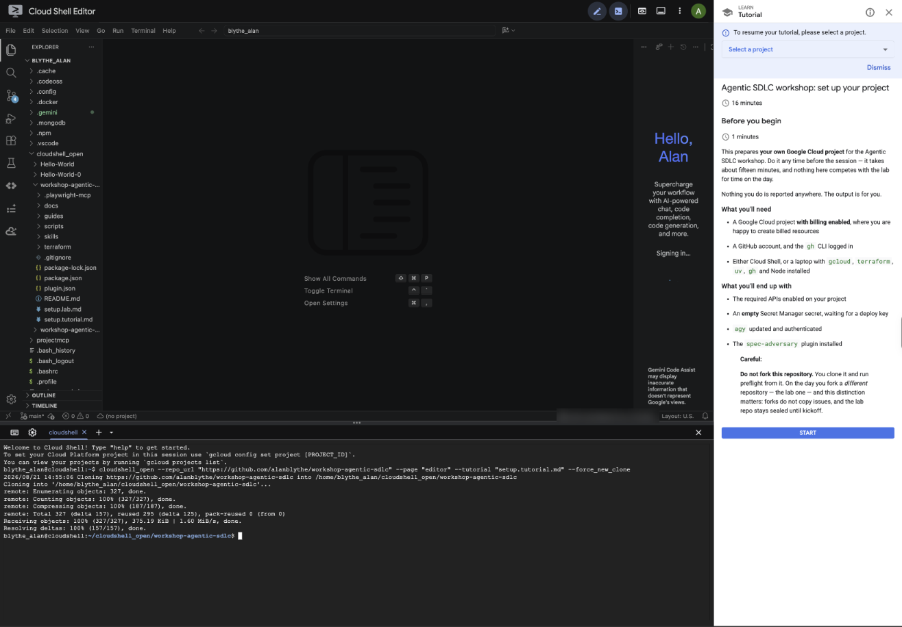

<!-- Generated from guides/setup.md.hbs by npm run build. Do not edit. -->
summary: Prepare your own Google Cloud project for the Agentic SDLC workshop
id: agentic-sdlc-setup
categories: cloud,agents
environments: Web
status: Published
authors: Alan Blythe
feedback link: https://github.com/alanblythe/workshop-agentic-sdlc/issues

# Agentic SDLC workshop: set up your project

## Before you begin

Duration: 1

This prepares **your own Google Cloud project** for the Agentic SDLC
workshop. Do it any time before the session — it takes about fifteen minutes,
and nothing here competes with the lab for time on the day.

Nothing you do is reported anywhere. The output is for you.

### What you'll need

- A Google Cloud project **with billing enabled**, where you are happy to
  create billed resources
- A GitHub account, and the `gh` CLI logged in
- Either Cloud Shell, or a laptop with `gcloud`, `terraform`, `uv`, `gh` and
  Node installed

### What you'll end up with

- The required APIs enabled on your project
- An **empty** Secret Manager secret, waiting for a deploy key
- `agy` updated and authenticated
- The `spec-adversary` plugin installed

> aside negative
>
> **Do not fork this repository.** You clone it and run preflight from it. On
> the day you fork a *different* repository — the lab one. Forks do not copy
> issues, and the lab repo stays sealed until kickoff.

## Get the repository

Duration: 2

The quickest route is Cloud Shell, which already has most of the toolchain.
The button clones the repository *and* opens this guide in a panel beside
the shell, so each step sits next to the terminal you are typing it into.

<button>[Open in Cloud Shell](https://shell.cloud.google.com/cloudshell/editor?cloudshell_git_repo=https://github.com/alanblythe/workshop-agentic-sdlc&cloudshell_tutorial=setup.tutorial.md)</button>



> aside positive
>
> Tick **Trust repo** when Cloud Shell asks. It is remembered, and it is what
> gives you a normal session with your real home directory rather than an
> ephemeral one that discards anything you install.

> aside negative
>
> **Do not click that button twice.** It clones again rather than updating,
> producing `workshop-agentic-sdlc-0`, `-1`, and opening the new copy — so
> your earlier work sits in a directory you are no longer looking at. If you
> come back later, `cd` into your existing clone and `git pull` instead.

Prefer your own machine? Clone it normally:

```bash
git clone https://github.com/alanblythe/workshop-agentic-sdlc.git
cd workshop-agentic-sdlc
```

## Point at your project and authenticate

Duration: 2

Set the project you want to use:

```bash
gcloud config set project YOUR_PROJECT_ID
gcloud config get-value project
```

Then authenticate. You need **two** grants here, not one:

```bash
gcloud auth login --update-adc
```

`--update-adc` is easy to miss. Application Default Credentials are a
separate file from your `gcloud` login, and Terraform reads only that file —
never your `gcloud` configuration.

> aside negative
>
> If you keep more than one `gcloud` configuration and switch with
> `CLOUDSDK_CONFIG`, note that **Terraform ignores it entirely**. It reads
> `GOOGLE_APPLICATION_CREDENTIALS`, then a fixed path. Preflight handles this
> for you, but it explains an error that claims your project does not exist.

## Choose your two locations

Duration: 2

Two settings, and they are **not** the same value:

| Variable | Value | What it controls |
| --- | --- | --- |
| `MODEL_LOCATION` | `global` | Where the model answers from |
| `AGENT_ENGINE_LOCATION` | `us-central1` | Where your agent runs |

```bash
export MODEL_LOCATION=global
export AGENT_ENGINE_LOCATION=us-central1
```

> aside negative
>
> **Do not set both to the same value.** The workshop uses `gemini-3.6-flash`, and the whole Gemini 3 family is served
> *only* from `global`. A regional endpoint returns a 404 that names the model,
> so it reads like a typo in the model name rather than a wrong location.

Preflight refuses to run if either is unset, or if the two match. There are no
defaults on purpose: a guessed region builds a URL that
resolves, and points somewhere else.

Add both to `~/.bashrc` if you want them to survive a new shell.

## Update agy

Duration: 2

Cloud Shell ships `agy`, but the version varies between sessions. Update it so
everyone is on the same release:

```bash
sudo agy update && agy --version
```

`sudo` is needed because the binary lives in `/usr/bin`; without it the updater
refuses with `directory /usr/bin is not fully accessible`.

> aside negative
>
> **Run this every session.** `/usr/bin` is on the VM rather than the persistent
> disk, so the update is discarded when Cloud Shell recycles.

On a laptop, install it with `brew install --cask antigravity-cli`. The command
is **`agy`**, not `antigravity`.

## Authenticate agy

Duration: 3

`agy` has **its own login, separate from `gcloud`**. Authenticating gcloud does
nothing for it — it holds its own OAuth grant with its own scopes. Two logins,
not one. There is no `agy login` subcommand; authentication happens on first
use.

Maximise your terminal first. The login prints a very long URL, and a narrow
terminal wraps it across six or more lines.

```bash
agy
```

You will be asked to open a URL, then to paste back a code. Approve in the
browser, copy the code it shows, paste it into the `authorization code...`
field, press Enter, then leave with `/quit`.

> aside negative
>
> **In the Cloud Shell terminal panel, do not click the URL.** It wraps, and the
> click sends only the line you clicked — Google answers `Error 400 (Bad
> Request)`, `invalid_request`, because the rest of the parameters never arrive.
> Run `agy` from a terminal inside the editor instead — **View → Terminal**, or
> `` Ctrl+` `` — where a click opens the whole link. Selecting the URL across the wrap and
> pasting it works too.

> aside negative
>
> Use plain `agy`, **not** `agy -p`. Print mode caps the wait at 60 seconds and
> then fails with `authentication interrupted`. The interactive prompt has no
> timeout — it waits at an input field for as long as you need.

The browser does not have to be on this machine. The redirect goes to a hosted
callback rather than a localhost listener, which is what makes this work in
Cloud Shell.

### Verify your work

```bash
agy -p "Reply with exactly: authenticated"
```

Answering without prompting for a URL means the grant is in place. Unlike the
binary, it lives under `~/.gemini` and does survive a session recycle.

## Run preflight

Duration: 3

This checks everything above, then provisions your project.

Look first if you like — with `--plan-only` it changes nothing at all:

```bash
bash scripts/preflight.sh --plan-only
```

Then run it for real:

```bash
bash scripts/preflight.sh
```

It verifies your tools, that npm and github are reachable, that billing is
linked, that the APIs are on, and that `gemini-3.6-flash` genuinely answers for
you — with a real call, because a catalog entry describes the model rather than
your access to it. Then it applies the Terraform.

> aside positive
>
> **Failures do not stop it.** Every problem is listed at the end with the exact
> command that fixes it, so you get the whole list in one run rather than
> discovering them one at a time. Fix them and run it again — it is safe to
> re-run, and safe to run in a fresh clone.

### Verify your work

A successful run ends with:

```
== ready ==
  Everything checked out. Nothing to do until the session.
```

If you are on a corporate network, the checks most likely to fail are npm and
github reachability. Both are needed before any Google Cloud resource is
involved, because the ADK skills install through `npx`.

## You're ready

Duration: 1

Preflight created an **empty** secret named `agentic-sdlc-deploy-key`. It stays
empty until the day: the key is generated against the repository you fork
during the lab, which does not exist yet.

Nothing is running, so nothing is costing you anything. The agent is deployed
during the session, and the last step of the lab tears it all down again.

If you had to fix anything, re-run `bash scripts/preflight.sh` until it reports
**ready**, and bring that result to the session.
